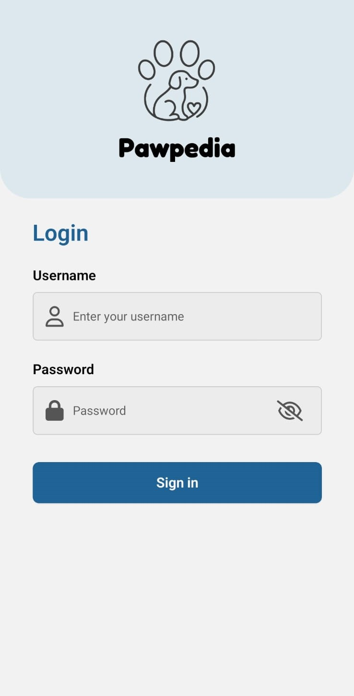
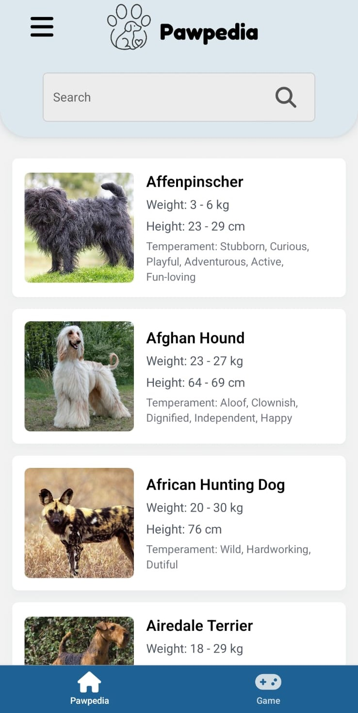
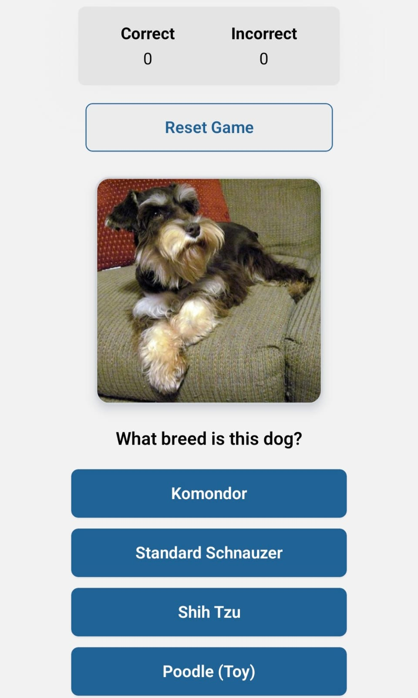
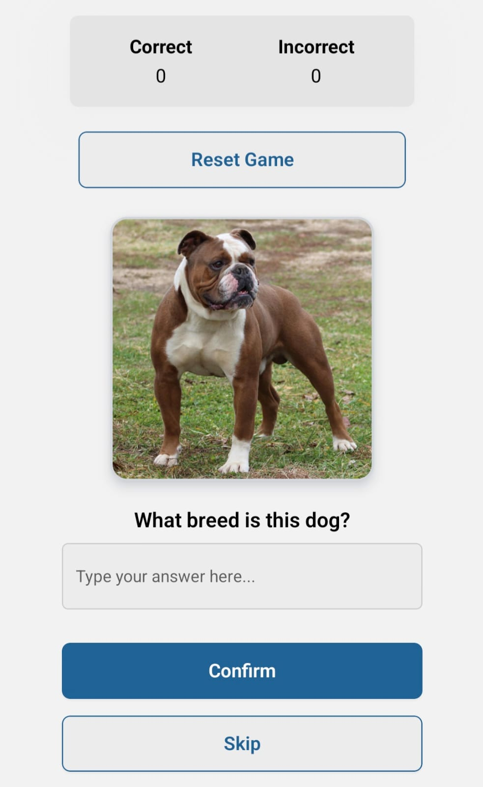

# Welcome to Dog Breeds App 👋

This is an [Expo](https://expo.dev) project created with [`create-expo-app`](https://www.npmjs.com/package/create-expo-app).

The app allows users to **log in**, browse a **list of dog breeds** fetched from [The Dog API](https://thedogapi.com/), and play a fun **quiz game** available in two modes: **Easy** and **Hard**.  

## Get started

1. Install dependencies

   ```bash
   npm install
   ```
   
2. Install dependencies

To start the project, you have two options:
   ```bash
  npm start
  ```
   or
   ```bash
   npx expo start --localhost
   ```

## Features

- 🔐 **Login system** to access the app  
   

- 📋 **Dog breeds list** powered by **The Dog API**  
   


- 🎮 **Quiz game** with two difficulty levels:  
  - **Easy Mode** → Select the correct breed from multiple options.  
  - **Hard Mode** → Type the breed name from memory and try to get **as many correct answers as possible** — more challenging! 


   <p align="center">
      
      &nbsp;&nbsp;&nbsp;
      
   </p>

## API Reference

This app uses **The Dog API** to fetch dog breeds and related information:  
👉 [https://thedogapi.com/](https://thedogapi.com/) 

## 👩‍💻 Author

Developed with by **Valeria Rodríguez** ✨  
